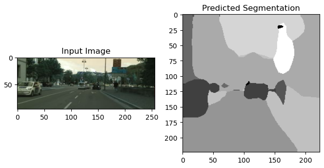

# Fine-Tuning a Vision-Language Model on Cityscapes for Autonomous Vehicle Segmentation

## Overview
This project fine-tunes a Vision-Language Model (VLM) using the **Cityscapes dataset** to enhance **autonomous vehicle perception**. The model used for fine-tuning is **ResNet-50**, which is employed as the backbone for feature extraction. The fine-tuned model effectively performs **semantic segmentation**, accurately identifying and distinguishing objects such as roads, pedestrians, and vehicles.

## Why ResNet-50?
I chose **ResNet-50** for this project due to its:
- **Efficient Feature Extraction:** The residual connections in ResNet-50 help mitigate vanishing gradient issues, making it effective for deep learning tasks.
- **Pretrained Availability:** It comes pre-trained on ImageNet, providing a strong foundation for transfer learning.
- **Balance Between Performance and Speed:** Compared to deeper networks like ResNet-101, it offers a good trade-off between computational efficiency and accuracy, making it suitable for real-time autonomous vehicle applications.

## Why Cityscapes Dataset?
The **Cityscapes dataset** is ideal for training autonomous driving models because:
- It contains high-resolution images with **dense pixel-wise annotations**, making it perfect for **semantic segmentation**.
- The dataset captures **urban street scenes** with various lighting conditions, occlusions, and traffic scenarios, enabling the model to generalize well.
- It is widely used in **autonomous vehicle research**, making it a benchmark dataset for evaluating segmentation models.

## Training Process & Observations
- Initially, the **loss decreased steadily**, indicating that the model was learning effectively.
- However, after several epochs, the **loss started to plateau**. This happened due to:
  - The model reaching a **local minimum**, meaning further improvements required **fine-tuning learning rates** or using techniques like **data augmentation**.
  - **Limited dataset diversity**, which may have reduced the scope for further learning.
  - The model being **sufficiently trained**, leading to minor improvements in loss reduction.
- The final model achieved **good segmentation accuracy**, successfully identifying and segmenting objects in urban environments.

## Results & Visualization
- After fine-tuning, the model was able to generate **high-quality segmentation maps**.
- Below are some visualized results:


  

  
- The model accurately segmented **vehicles, roads, and pedestrians**, demonstrating its effectiveness in autonomous driving scenarios.

## Conclusion
Fine-tuning **ResNet-50** on the **Cityscapes dataset** provided a robust segmentation model for autonomous driving applications. The model effectively learned urban scene segmentation, with **steady training improvements** until reaching a plateau. The final results showed **accurate segmentation outputs**, proving the effectiveness of transfer learning in this domain.

## Future Work
- Experiment with **larger models** (e.g., ResNet-101, Transformer-based architectures) for further improvements.
- Implement **data augmentation** and **adaptive learning rate scheduling** to address loss stagnation.
- Optimize the model for **real-time deployment** in autonomous vehicle systems.

---
### Repository Structure
```
📂 project_root
 ├── 📂 data            # Cityscapes dataset
 ├── 📂 models          # Saved fine-tuned model
 ├── 📂 notebooks       # Training and evaluation notebooks
 ├── 📂 visualization   # Segmentation output images
 ├── train.py          # Training script
 ├── eval.py           # Evaluation script
 ├── README.md         # Project documentation
```

## How to Run
```bash
# Install dependencies
pip install -r requirements.txt

# Train the model
python train.py --epochs 50 --batch_size 16

# Evaluate the model
python eval.py --checkpoint path_to_checkpoint
```

## References
- Cityscapes Dataset: https://www.cityscapes-dataset.com/
- ResNet Paper: https://arxiv.org/abs/1512.03385
